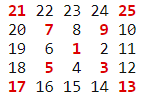

## Number spiral diagonals
### Problem 28

Starting with the number 1 and moving to the right in a clockwise direction a 5 by 5 spiral is formed as follows:

It can be verified that the sum of the numbers on the diagonals is 101.

What is the sum of the numbers on the diagonals in a 1001 by 1001 spiral formed in the same way?