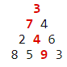

## Maximum path sum II
### Problem 67
By starting at the top of the triangle below and moving to adjacent numbers on the row below, the maximum total from top to bottom is 23.

That is, 3 + 7 + 4 + 9 = 23.

Find the maximum total from top to bottom in [problem_067.dat](../Data/problem_067.dat), a 15K text file containing a triangle with one-hundred rows.
