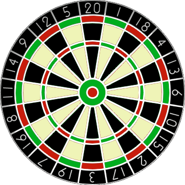

## Darts
### Problem 109

In the game of darts a player throws three darts at a target board which is split into twenty equal sized sections numbered one to twenty.

The score of a dart is determined by the number of the region that the dart lands in. A dart landing outside the red/green outer ring scores zero. The black and cream regions inside this ring represent single scores. However, the red/green outer ring and middle ring score double and treble scores respectively.

At the centre of the board are two concentric circles called the bull region, or bulls-eye. The outer bull is worth 25 points and the inner bull is a double, worth 50 points.

There are many variations of rules but in the most popular game the players will begin with a score 301 or 501 and the first player to reduce their running total to zero is a winner. However, it is normal to play a "doubles out" system, which means that the player must land a double (including the double bulls-eye at the centre of the board) on their final dart to win; any other dart that would reduce their running total to one or lower means the score for that set of three darts is "bust".

When a player is able to finish on their current score it is called a "checkout" and the highest checkout is 170: T20 T20 D25 (two treble 20s and double bull).

There are exactly eleven distinct ways to checkout on a score of 6:

1. D3
1. D1, D2
1. S2, D2
1. D2, D1
1. S4, D1
1. S1, S1, D2
1. S1, T1, D1
1. S1, S3, D1
1. D1, D1, D1
1. D1, S2, D1
1. S2, S2, D1

Note that D1 D2 is considered **different** to D2 D1 as they finish on different doubles. However, the combination S1 T1 D1 is considered the **same** as T1 S1 D1.

In addition we shall not include misses in considering combinations; for example, D3 is the **same** as 0 D3 and 0 0 D3.

Incredibly there are 42336 distinct ways of checking out in total.

How many distinct ways can a player checkout with a score less than 100?
