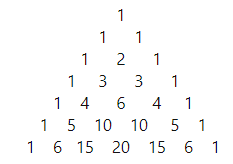

## Exploring Pascal's triangle
### Problem 148

We can easily verify that none of the entries in the first seven rows of Pascal's triangle are divisible by 7:

However, if we check the first one hundred rows, we will find that only 2361 of the 5050 entries are not divisible by 7.

Find the number of entries which are not divisible by 7 in the first one billion (109) rows of Pascal's triangle.
