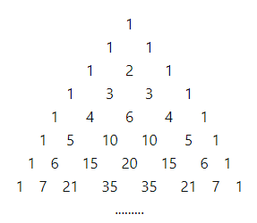

## Squarefree Binomial Coefficients
## Problem 203

The binomial coefficients $\binom{n}{k}$ can be arranged in triangular form, Pascal's triangle, like this:

It can be seen that the first eight rows of Pascal's triangle contain twelve distinct numbers: 1, 2, 3, 4, 5, 6, 7, 10, 15, 20, 21 and 35.

A positive integer $n$ is called squarefree if no square of a prime divides $n$. Of the twelve distinct numbers in the first eight rows of Pascal's triangle, all except 4 and 20 are squarefree. The sum of the distinct squarefree numbers in the first eight rows is 105.

Find the sum of the distinct squarefree numbers in the first 51 rows of Pascal's triangle.
